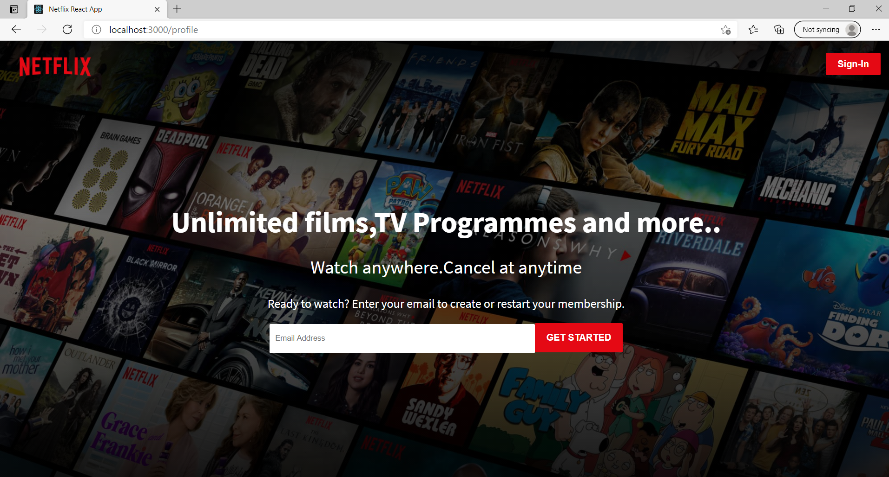
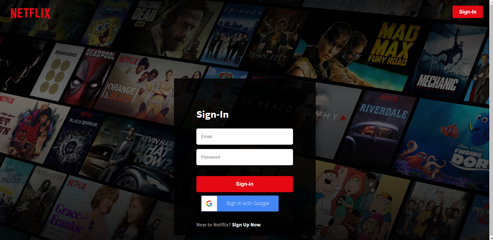
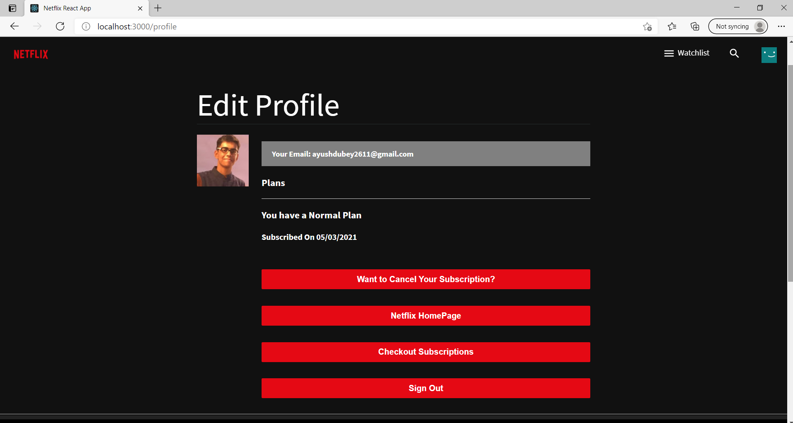
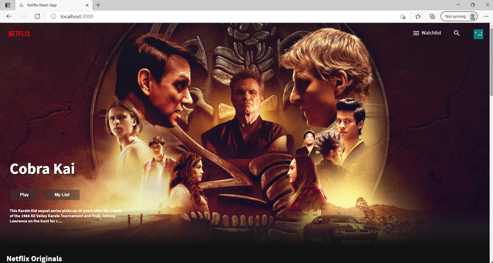
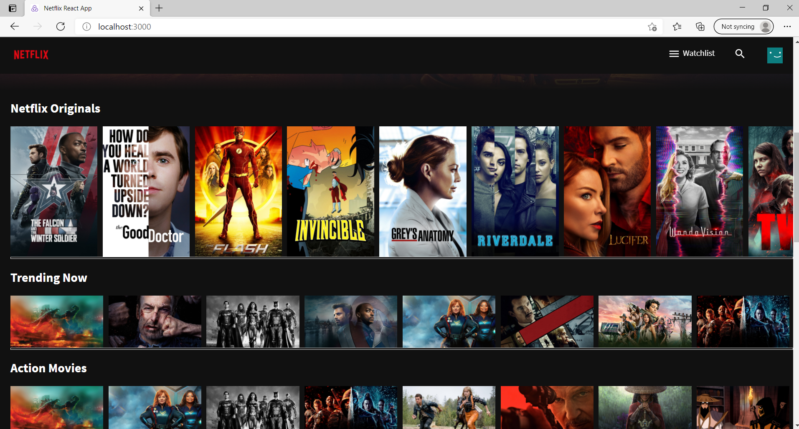
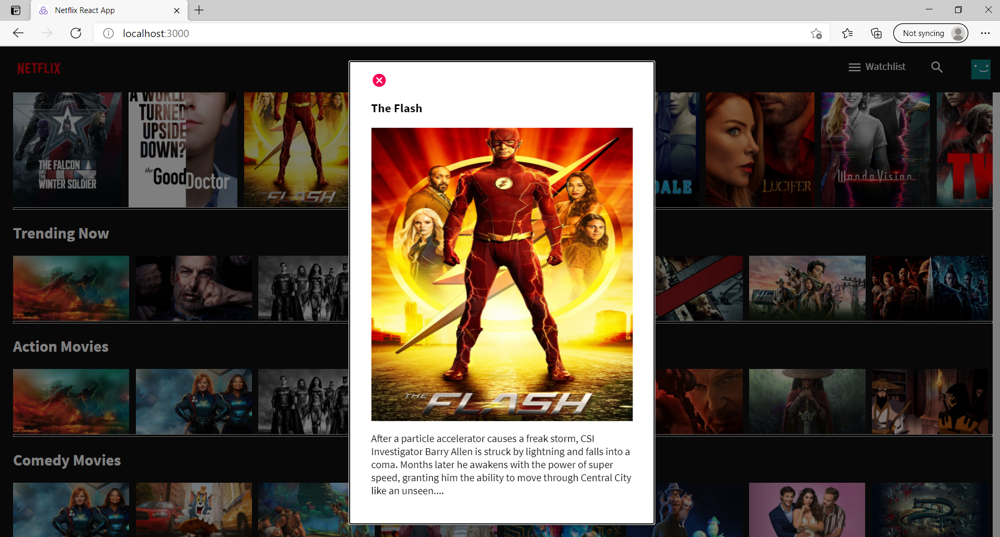
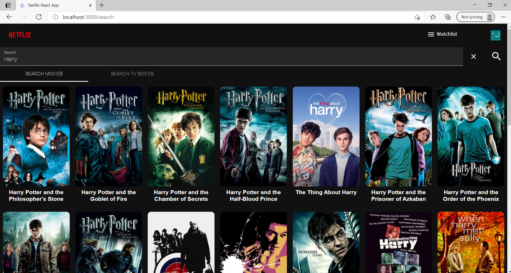
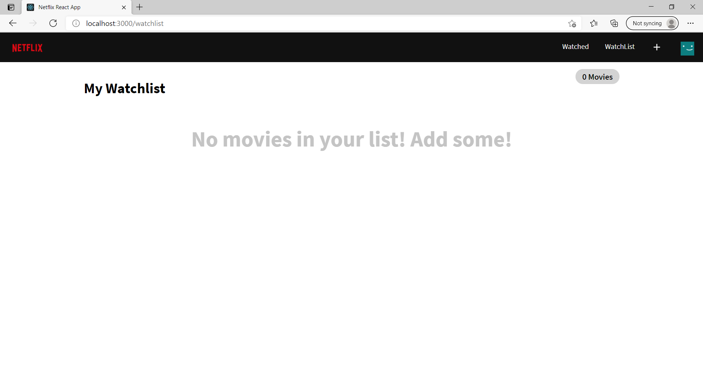
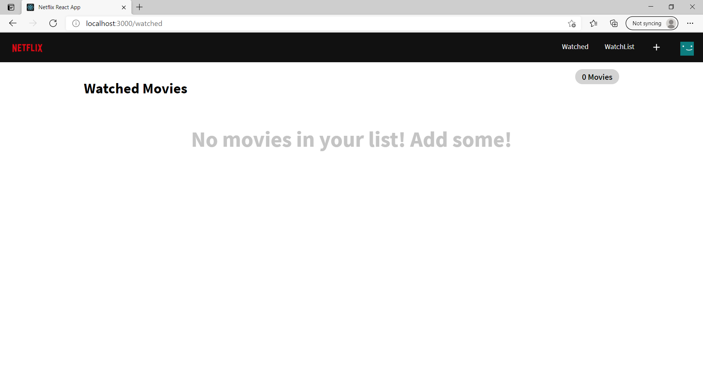
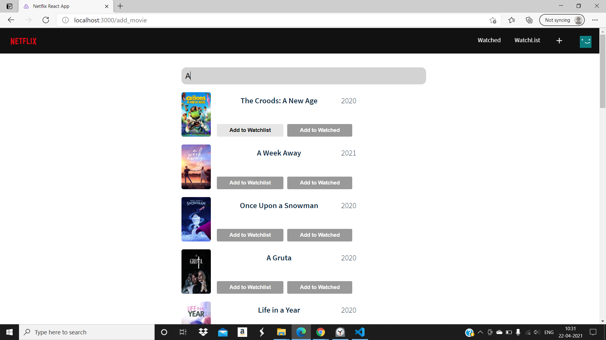

## Netflix Clone:
>This is a Netflix Clone built on React and firebase.

>## ` Packages to be installed:`
> ### `npm install:`
    "@material-ui/core"
    "@material-ui/icons"
    "@material-ui/lab"
    "@reduxjs/toolkit"
    "axios"
    "dotenv"
    "firebase"
    "moment"
    "react"
    "react-alice-carousel"
    "react-dom"
    "react-elastic-carousel"
    "react-google-button"
    "react-moment"
    "react-redux"
    "react-router-dom"
    "styled-components"

> ### `This app also includes Redux for the user-auth changes`

> ## Code Output:

## Sign-Up/Login Page:

## User Profile Page:

## Home-Page Output:

## Search-Page:

## WatchList-Page:

## Add to WatchList:

